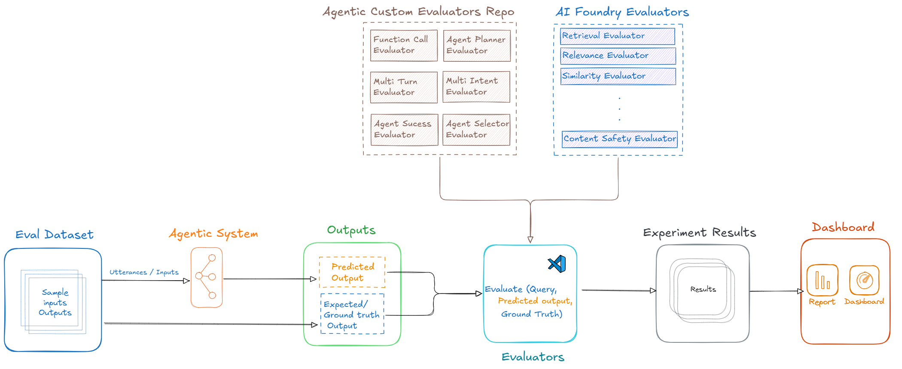

# Evaluation of Agentic Systems using Azure AI Foundry

Agents are AI models with memories that communicate via messages. They can interact with themselves, other agents, or the human user, these messages include text, multimodalities, and tools or function calls, forming a chat history/thread/trajectory.
Agentic systems can range from single agents with tool calling to complex multi-agent systems that communicate to complete tasks. Building an evaluation pipeline for such systems starts with creating ground truth datasets based on real-world usage. 

Agentic system's can itself be quite complex and evaluating every stage of their architecture could be quite a difficult task to analyze. Evaluations for these Agentic systems are crucial to ensure they function as intended, are safe, reliable, and perform optimally under varying conditions. 

This framework provides a step-by-step approch to building a pipeline to Evaluate agentic system using Azure AI Foundry, using single agent with multiple plugins from Sematic Kernel as an example. This repository provides a reporting framework using html report locally to analyze, visualize and share the evaluation results to various stake holders. 

## Agentic Evaluation Pipeline (Inner Loop)
Inputs are fed to agentic systems, and outputs—either end responses or inner workings like function calls, agent selection, and communication—are evaluated.
Extracting these inner details is crucial for robust evaluation. Evaluators compare predicted data to ground truth data, scoring them accordingly. 
Currently, specialized evaluators for agentic systems need to be custom-built, as existing AI foundry tools support RAG and chatbot applications only. 
Finally, evaluation results are stored and visualized both in AI Foundry's evaluator dashboard and a custom HTML Report built using Jinja2 template. 

Agentic-Eval-Pipeline is a Python-based framework for building and evaluating agentic systems.



## Folder Structure
```
project-root/
│
├── src/                # Source code for the framework
│   ├── __init__.py     # Makes src a package
│   ├── pipeline.py     # Core pipeline logic
│   ├── data_generator/ # Code for generating data
│   ├── data_transforms/ # Code for transforming data
│   ├── evaluator/      # Code for evaluation logic
│   ├── datasets/       # Code for dataset management
│   └── report_generator/ # Code for generating reports
│
├── config/             # Configuration files
│   ├── settings.py     # General settings
│   └── config.yaml     # YAML configuration file
│
├── requirements.txt    # Python dependencies
├── .gitignore          # Git ignore rules
├── README.md           # Project documentation
└── LICENSE             # License file
```

## Installation
1. Clone the repository:
   ```bash
   git clone https://github.com/your-username/agentic-evals.git
   ```
2. Navigate to the project directory:
   ```bash
   cd agentic-evals
   ```
3. Install dependencies:
   ```bash
   pip install -r requirements.txt
   ```

## Usage
1. Run the pipeline:
   ```bash
   python src/pipeline.py
   ```
2. Customize the pipeline by modifying `src/pipeline.py` or adding new modules under `src/`.

## Contributing
...existing code...

## License
...existing code...